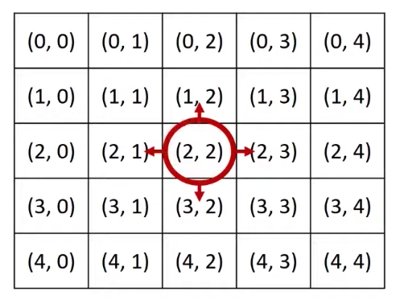
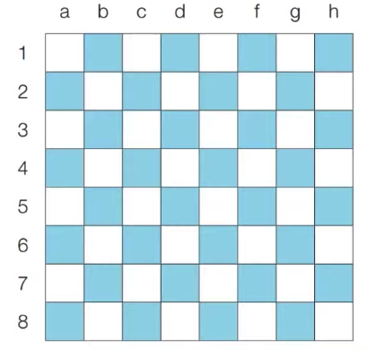
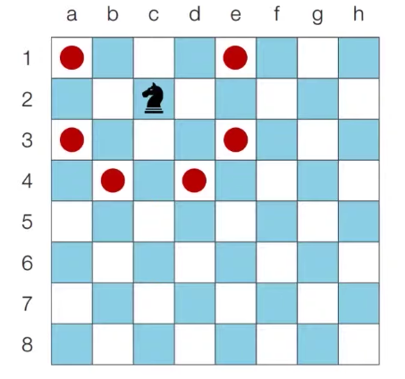
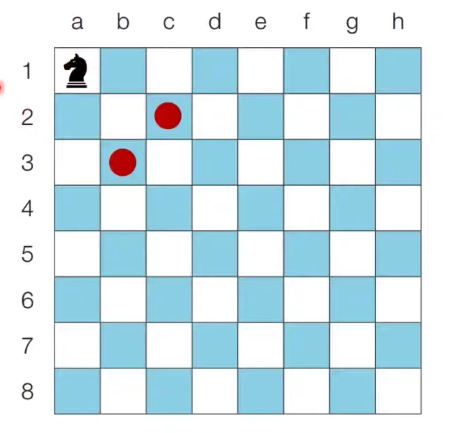

# 2021년 7월 25일
# 그리디 알고리즘
- 그리디 알고리즘은(탐욕법)은 현재 상황에서 지금 당장 좋은 것만 고르는 방법을 의미한다.
- 일반적인 그리디 알고리즘은 문제를 풀기 위한 최소한의 아이디어를 떠올릴 수 있는 능력을 요구한다.
- 그리디 해법은 그 정당성 분석이 중요하다.
    - 단순히 가장 좋아 보이는 것을 반복적으로 선택해도 최적의 해를 구할 수 있는지 검토한다.

## <문제> 거스름 돈
***
- 당신은 음식점의 계산을 도와주는 점원입니다. 카운터에는 거스름돈으로 사용할 500원, 100원, 50원, 10원짜리 동전이 무한히 존재한다고 가정합니다. 손님에게 거슬러 주어야 할 돈이 N원일 때 거슬러 주어야 할 동전의 최소 개수를 구하세요. 단, 거슬러 줘야 할 돈 N은 항상 10의 배수입니다.
```python
a = int(input())
b = [500, 100, 50, 10]
dong = 0
for i in b :
    dong += a // i # 거스른 동전의 수를 dong에 추가해준다
    a = a % i # 나머지를 다시 위쪽 a로 넘겨준다 
print(dong)
```
- 화폐의 종류가 K라고 할 때, 소스코드의 시간 복잡도는 O(K)입다
- 이 알고리즘의 시간 복잡도는 거슬러줘야 하는 금액과는 무관하며, 동전의 총 종류에만 영향을 받는다.
***
## <문제> 1이 될 때까지 
- 어떤수 N이 1이 될 때까지 다음의 두 과정 중 하나를 반복적으로 선택하여 수행하려고한다. 단, 두번째 연산은 N이 K로 나누어떨어질 때만 선택할 수 있다.
1. N에서 1을 뺀다.
2. N을 K로 나눈다.
```
예를 들어 N = 17, K = 4일 경우
```
1) 17 - 1 = 16
2) 16 // 4 = 4
3) 4 // 4 = 1
***
- 전체 과정을 실행한 횟수는 3이 된다. 이는 N을 1로 만드는 최소 횟수이다.
```python
n, k = map(int, input().split())
result = 0

while n != 1 :
    if n % k != 0 :
        n = n -1
        result += 1
    else : 
        n = n / k
        result += 1
print(result)
```
<br></br>

# 구현
- 구현이란, 머릿속에 있는 알고리즘을 소스코드로 바꾸는 과정입니다.
- 흔히 알고리즘 대회에서 구현 유형의 문제란 무엇을 의미할까 ?
    - 풀이를 떠올리는 것은 쉽지만 소스코드로 옮기기 어려운 문제를 지칭한다.
- 구현 유형의 예시는 다음과 같다
    - 알고리즘은 간단한데 코드가 지나칠 만큼 길어지는 문제
    - 실수 연산을 다루고, 특정 소수점 자리까지 출력해야하는 문제
    - 문자열을 특정한 기준에 따라서 끊어 처리해야 하는 문제
    - 적절한 라이브러리를 찾아서 사용해야 하는 문제
- 일반적으로 알고리즘 문제에서의 2차원 공간은 행렬(Matrix)의 의미로 사용된다


<br></br>

```python
for i in range(5) :
    for j in range(5):
        print('(', i, ', ', j, ')', end=' ')
```
- 시물레이션 및 완전 탐색 문제에서는 2차원 공간에서의 방향 벡터가 자주 활용된다.



<br></br>

```python
# 동, 북, 서, 남
dx = [0, -1, 0, 1]
dy = [1, 0, -1, 0]

# 현재 위치
x, y = 2, 2

for i in range(4):
    # 다음 위치
    nx = x + dx[i]
    ny = y + dy[i]
    print(nx, ny)
```
## <문제> 상화좌우 : 문제 설명
- 여행가 A는 N × N 크기의 정사각형 공간 위에 서 있다. 이 공간은 1 × 1 크기의 정사각형으로 나누어져 있다.
가장 왼쪽 위 좌표는 (1, 1)이며, 가장 오른쪽 아래 좌표는 (N, N)에 해당한다.
여행가 A는 상, 하, 좌, 우 방향으로 이동할 수 있으며, 시작 좌표는 항상 (1, 1)이다. 우리 앞에는 여행가 A가 이동할 계획이 적힌 계획서가 놓여 있다
- 계획서에는 하나의 줄에 띄어쓰기를 기준으로 L, R, U, D 중 하나의 문자가 반복적으로 적혀있다.
각 문자의 의미는 다음과 같다
    - L: 왼쪽으로 한 칸 이동
    - R: 오른쪽으로 한 칸 이동
    - U: 위로 한 칸 이동
    - D: 아래로 한 칸 이동
- 이때 여행가 A가 N × N 크기의 정사각형 공간을 벗어나는 움직임은 무시된다
예를 들어 (1, 1)의 위치에서 L 혹은 U를 만나면 무시된다
다음은 N = 5인 지도와 계획이다

```python
# N 입력 받기
n = int(input())
x, y = 1, 1
plans = input().split()

# L, R, U, D에 따른 이동 방향
dx = [0, 0, -1, 1]
dy = [-1, 1, 0, 0]
move_types = ['L', 'R', 'U', 'D']

# 이동 계획을 하나씩 확인하기
for plan in plans:
    # 이동 후 좌표 구하기
    for i in range(len(move_types)):
        if plan == move_types[i]:
            nx = x + dx[i]
            ny = y + dy[i]
        # 공간을 벗어나는 경우 무시
        if nx < 1 or ny < 1 or nx > n or ny > n:
            continue
        # 이동 수행
        x, y = nx, ny
print(x, y)
```

## <문제> 시각: 문제 설명
- 정수 N이 입력되면 00시 00분 00초부터 N시 59분 59초까지의 모든 시각 중에서 3이 하나라도 포함되는 모든 경우의 수를 구하는 프로그램을 작성하라. 예를 들어 1을 입력했을 때 다음은 3이 하나라도 포함되어 있으므로 세어야 하는 시각이다.
    - 00시 00분 03초
    - 00시 13분 30초
- 반면에 다음은 3이 하나도 포함되어 있지 않으므로 세면 안 되는 시각이다.
    - 00시 02분 55초
    - 01시 27분 45초

- 이 문제는 가능한 모든 시각의 경우를 하나씩 모두 세서 풀 수 있는 문제이다
- 하루는 86,400초이므로, 00시 00분 00초부터 23시 59분 59초까지의 모든 경우는 86,400가지 이다
    - 24 * 60 * 60 = 86,400
- 따라서 단순히 시각을 1씩 증가시키면서 3이 하나라도 포함되어 있는지를 확인하면 된다
- 이러한 유형은 완전 탐색(Brute Forcing) 문제 유형이라고 불린다
- 가능한 경우의 수를 모두 검사해보는 탐색 방법을 의미한다

```python
# H 입력 받기
h = int(input())

count = 0
for i in range(h + 1):
    for j in range(60):
        for k in range(60):
            # 매 시각 안에 '3'이 포함되어 있다면 카운트 증가
            if '3' in str(i) + str(j) + str(k):
                count += 1

print(count)
```

## <문제> 왕실의 나이트: 문제 설명
- 행복 왕국의 왕실 정원은 체스판과 같은 8 × 8 좌표 평면이다. 왕실 정원의 특정한 한 칸에 나이트가 서있다.
나이트는 매우 충성스러운 신하로서 매일 무술을 연마한다
- 나이트는 말을 타고 있기 때문에 이동을 할 때는 L자 형태로만 이동할 수 있으며 정원 밖으로는 나갈 수 없다
- 나이트는 특정 위치에서 다음과 같은 2가지 경우로 이동할 수 있다
    1. 수평으로 두 칸 이동한 뒤에 수직으로 한 칸 이동하기
    2. 수직으로 두 칸 이동한 뒤에 수평으로 한 칸 이동하기



- 이처럼 8 × 8 좌표 평면상에서 나이트의 위치가 주어졌을 때 나이트가 이동할 수 있는 경우의 수를 출력하는 프로그램을 작성하라. 왕실의 정원에서 행 위치를 표현할 때는 1부터 8로 표현하며, 열 위치를 표현할 때는 a 부터 h로 표현한다
    - c2에 있을 때 이동할 수 있는 경우의 수는 6가지이다



- a1에 있을 때 이동할 수 있는 경우의 수는 2가지이다



<br></br>
## <문제> 왕실의 나이트: 문제 조건
***


## <문제> 왕실의 나이트: 문제 해결 아이디어
- 요구사항대로 충실히 구현하면 되는 문제이다
- 나이트의 8가지 경로를 하나씩 확인하며 각 위치로 이동이 가능한지 확인한다
- 리스트를 이용하여 8가지 방향에 대한 벡터를 정의 한다

### <문제> 왕실의 나이트: 답안 예시 (Python)
```python
# 현재 나이트의 위치 입력받기
input_data = input()
row = int(input_data[1])
column = int(ord(input_data[0])) - int(ord('a')) + 1

# 나이트가 이동할 수 있는 8가지 방향 정의
steps = [(-2, -1), (-1, -2), (1, -2), (2, -1), (2, 1), (1, 2), (-1, 2), (-2, 1)]

# 8가지 방향에 대하여 각 위치로 이동이 가능한지 확인
result = 0
for step in steps:
    # 이동하고자 하는 위치 확인
    next_row = row + step[0]
    next_column = column + step[1]
    # 해당 위치로 이동이 가능하다면 카운트 증가
    if next_row >= 1 and next_row <= 8 and next_column >= 1 and next_column <= 8:
        result += 1

print(result)
```