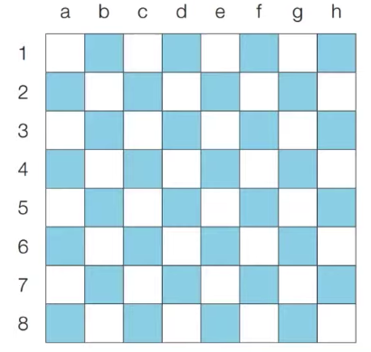
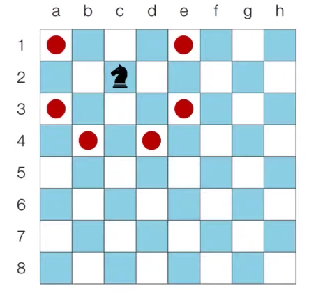
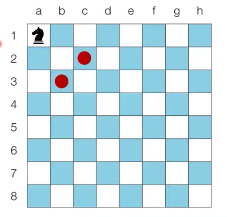

# 2021년 8월 01일
# 이것이 코딩 테스트다(문제) 
## <문제> 시각: 문제 설명
- 정수 N이 입력되면 00시 00분 00초부터 N시 59분 59초까지의 모든 시각 중에서 3이 하나라도 포함되는 모든 경우의 수를 구하는 프로그램을 작성하라. 예를 들어 1을 입력했을 때 다음은 3이 하나라도 포함되어 있으므로 세어야 하는 시각이다.
    - 00시 00분 03초
    - 00시 13분 30초
- 반면에 다음은 3이 하나도 포함되어 있지 않으므로 세면 안 되는 시각이다.
    - 00시 02분 55초
    - 01시 27분 45초

- 이 문제는 가능한 모든 시각의 경우를 하나씩 모두 세서 풀 수 있는 문제이다
- 하루는 86,400초이므로, 00시 00분 00초부터 23시 59분 59초까지의 모든 경우는 86,400가지 이다
    - 24 * 60 * 60 = 86,400
- 따라서 단순히 시각을 1씩 증가시키면서 3이 하나라도 포함되어 있는지를 확인하면 된다
- 이러한 유형은 완전 탐색(Brute Forcing) 문제 유형이라고 불린다
- 가능한 경우의 수를 모두 검사해보는 탐색 방법을 의미한다

```python
# H 입력 받기
h = int(input())

count = 0
for i in range(h + 1):
    for j in range(60):
        for k in range(60):
            # 매 시각 안에 '3'이 포함되어 있다면 카운트 증가
            if '3' in str(i) + str(j) + str(k):
                count += 1

print(count)
```

## <문제> 왕실의 나이트: 문제 설명
- 행복 왕국의 왕실 정원은 체스판과 같은 8 × 8 좌표 평면이다. 왕실 정원의 특정한 한 칸에 나이트가 서있다.
나이트는 매우 충성스러운 신하로서 매일 무술을 연마한다
- 나이트는 말을 타고 있기 때문에 이동을 할 때는 L자 형태로만 이동할 수 있으며 정원 밖으로는 나갈 수 없다
- 나이트는 특정 위치에서 다음과 같은 2가지 경우로 이동할 수 있다
    1. 수평으로 두 칸 이동한 뒤에 수직으로 한 칸 이동하기
    2. 수직으로 두 칸 이동한 뒤에 수평으로 한 칸 이동하기



- 이처럼 8 × 8 좌표 평면상에서 나이트의 위치가 주어졌을 때 나이트가 이동할 수 있는 경우의 수를 출력하는 프로그램을 작성하라. 왕실의 정원에서 행 위치를 표현할 때는 1부터 8로 표현하며, 열 위치를 표현할 때는 a 부터 h로 표현한다
    - c2에 있을 때 이동할 수 있는 경우의 수는 6가지이다



- a1에 있을 때 이동할 수 있는 경우의 수는 2가지이다



<br></br>
## <문제> 왕실의 나이트: 문제 조건
***


## <문제> 왕실의 나이트: 문제 해결 아이디어
- 요구사항대로 충실히 구현하면 되는 문제이다
- 나이트의 8가지 경로를 하나씩 확인하며 각 위치로 이동이 가능한지 확인한다
- 리스트를 이용하여 8가지 방향에 대한 벡터를 정의 한다

### <문제> 왕실의 나이트: 답안 예시 (Python)
```python
# 현재 나이트의 위치 입력받기
input_data = input()
row = int(input_data[1])
column = int(ord(input_data[0])) - int(ord('a')) + 1

# 나이트가 이동할 수 있는 8가지 방향 정의
steps = [(-2, -1), (-1, -2), (1, -2), (2, -1), (2, 1), (1, 2), (-1, 2), (-2, 1)]

# 8가지 방향에 대하여 각 위치로 이동이 가능한지 확인
result = 0
for step in steps:
    # 이동하고자 하는 위치 확인
    next_row = row + step[0]
    next_column = column + step[1]
    # 해당 위치로 이동이 가능하다면 카운트 증가
    if next_row >= 1 and next_row <= 8 and next_column >= 1 and next_column <= 8:
        result += 1

print(result)
```