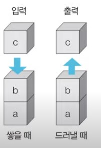
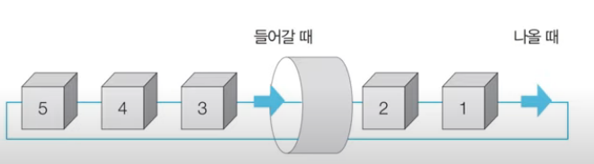
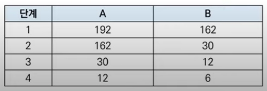

# 2021년 7월 25일
# 그래프 탐색 알고리즘(DFS/BFS)
- 탐색이란 많은 양의 데이터 중에서 원하는 데이터를 찾는 과정을 말합니다.
- 대표적인 그래프 탐색 알고리즘으로는 DFS와 BFS가 있습니다.
- DFS/BFS는 코딩 테스트에서 매우 자주 등장하는 유형이다

## 스택 자료구조
- 먼저 들어 온 데이터가 나중에 나가는 형식(선입후출)의 자료구조이다.
- 입구와 출구가 동일한 형태로 스택을 시각화할 수 있습니다.
---


---
```python
# 스택 구현 예제
stack = []
stack.append(5)
stack.append(2)
stack.append(3)
stack.append(7)
stack.pop()
stack.append(1)
stack.append(4)
stack.pop()

print(stack[::-1]) # 최상단 원소부터 출력 [1,3,2,5]
print(stack) # 최하단 원소부터 출력 [5,2,3,1]
```
## 큐 자료구조
- 먼저 들어 온 데이터가 먼저 나가는 형식(선입선출)의 자료구조이다.
- 큐는 입구와 출구가 모두 뚫려 있는 터널과 같은 형태로 시각화 할 수 있습니다.

---


```python
# 큐 예제
from collections import deque
queue = deque()
queue.append(5)
queue.append(2)
queue.append(3)
queue.append(7)
queue.popleft() # 가장 왼쪽에 있는 데이터를 꺼낸다
queue.append(1)
queue.append(4)
queue.popleft()

print(queue) # 먼저 들어온 순서대로 출력 deque([3,7,1,4])
queue.reverse()
print(queue) # 나중에 들어온 원소부터 출력 deque([4,1,7,3])
```

## 재귀 함수
- 재귀 함수(Recursive Function)란 자기 자신을 다시 호출하는 함수를 의미합니다.
- 단순한 형태의 재귀 함수 예제
    - '재귀 함수를 호출합니다.'라는 문자열을 무한히 출력합니다.
    - 어느 정도 출력하다가 최대 재귀 깊이 초과 메시지가 출력됩니다.

```python
def recursive_function() :
    print('재귀 함수를 호출합니다.') # 재귀함수는 maximum 존재
    recursive_function()
```
recursive_function()

## 재귀 함수의 종료 조건
- 재귀 함수를 문제 풀이에서 사용할 떄는 재귀 함수의 종료 조건을 반드시 명시해야 합니다.
- 종료 조건을 제대로 명시하지 않으면 함수가 무한히 호출될 수 있습니다.
    - 종료 조건을 포함한 재귀 함수 예제
```python
def recursive_function(i):
    # 100번째 호출을 했을 때 종료되도록 종료 조건 명시
    if i == 100:
        return
    print(i, '번째 재귀함수에서', i+1, '번째 재귀함수를 호출합니다.')
    recursive_function(i+1)
    print(i, '번째 재귀함수를 종료합니다.')
recursive_function(1)
```

# 팩토리얼 구현 예제
- n! = 1 x 2 x 3x ... x(n-1)x n
- 수학적으로 0!과 1!의 값은 1입니다.
```python
# 반복적으로 구현한 n!
def factorial_iterative(n):
    result = 1
    # 1부터 n까지의 수를 차례대로 곱하기
    for i in range(1, n + 1):
        result *= i
    return result
print('반복적으로 구현:', factorial_iterative(5)) # 반복적으로 구현 : 120
```
```python
# 재귀적으로 구현한 n!
def factorial_recursive(n):
    if n <= 1 : # n이 1 이하인 경우 1을 반환
        return 1
    # n! = n * (n-1)!를 그대로 코드로 작성하기
    return n * factorial_recursive(n -1)

# 각각의 방식으로 구현한 n! 출력 (n=5)

print('재귀적으로 구현:', factorial_recursive(5)) # 재귀적으로 구현: 120
```

# 최대공약수 계산 (유클리드 호제법) 예제
- 두 개의 자연수에 대한 최대공약수를 구하는 대표적인 알고리즘으로는 유클리드 호제법이 있습니다.
- 유클리드 호제법
    - 두 자연수 A, B에 대하여 (A>B) A를 B로 나눈 나머지를 R이라고 합시다.
    - 이때 A와 B의 최대공약수는 B와 R의 최대공약수와 같습니다.
- 유클리드 호제법의 아이디어를 그대로 재귀 함수로 작성할 수 있습니다.
    - 예시 : GCD(192, 162)
---
<br>

<br>
<br>


```python
def gcd(a, b):
    if a % b == 0:
        return b
    else:
        return gcd(b, a % b)
print(gcd(192,162)) # 6
```
## 재귀 함수 사용의 유의 사항
- 재귀 함수를 잘 활용하면 복잡한 알고리즘을 간결하게 작성할 수 있습니다.
    - 단, 오히려 다른 사람이 이해하기 어려운 형태의 코드가 될 수도 있으므로 신중하게 사용해야 합니다.
- 모든 재귀 함수는 반복문을 이용하여 동일한 기능을 구현할 수 있습니다.
- 재귀 함수가 반복문보다 유리한 경우도 있고 불리한 경우도 있습니다.
- 컴퓨터가 함수를 연속적으로 호출하면 컴퓨터 메모리 내부의 스택 프레임에 쌓입니다.
    - 그래서 스택을 사용해야 할 때 구현상 스택 라이브러리 대신에 재귀 함수를 이용하는 경우가 많습니다.


# DFS (Depth-First Search)
- DFS는 깊이 우선 탐색이라고도 부르며 그래프에서 깊은 부분을 우선적으로 탐색하는 알고리즘입니다.
- DFS는 스택 자료구조(혹은 재귀 함수)를 이용하며, 구체적인 동작 과정은 다음과 같습니다.
    1. 탐색 시작 노드를 스택에 삽입하고 방문 처리를 합니다.
    2. 스택의 최상단 노드에 방문하지 않은 인접한 노드가 하나라도 있으면 그 노드를 스택에 넣고 방분 처리합니다. 방문하지 않은 인접 노드가 없으면 스택에서 최상단 노드를 꺼냅니다.
    3. 더 이상 2번의 과정을 수행할 수 없을 때까지 반복합니다.

## DFS 소스코드 예제
```python
# DFS 메서드 정의
def dfs(graph, v, visited):
    visited[v] = True
    print(v, end='')
    # 현재 노드와 연결된 다른 노드를 재귀적으로 방문
    for i in graph[v]:
        if not visited[i]:
            dfs(graph, i, visited)
#각 노드가 연결된 정보를 표현(2차원 리스트)
graph = [
    [],
    [2,3,8],
    [1,7],
    [1,4,5],
    [3,5],
    [3,4],
    [7],
    [2,6,8],
    [1,7]
]
# 각 노드가 방문된 정보를 표현(1차원 리스트)
visited = [False] * 9
# 정의된 DFS 함수 호출
dfs(graph, 1, visited)
```

# BFS (Breadth-Fist Search)
- BFS는 너비 우선 탐색 이라고도 부르며, 그래프에서 가까운 노드부터 우선적으로 탐색하는 알고리즘입니다.
- BFS는 큐 자료구조를 이용하며, 구체적인 동작 과정은 다음과 같습니다.
    1. 탐색 시작 노드를 큐에 삽입하고 방문 처리를 합니다.
    2. 큐에서 노드를 꺼낸 뒤에 해당 노드의 인접 노드중에서 방문하지 않은 노드를 모두 큐에 삽입하고 방문 처리합니다.
    3. 더 이상 2번의 과정을 수행할 수 없을 때까지 반복합니다.
## BFS 소스코드 예제
```python
from collections import deque
                
# BFS 메서드 정의
def bfs(graph, start, visited):
    # 큐(Queue) 구현을 위해 deque 라이브러리 사용
    queue = deque([start])
    # 현재 노드를 방문 처리
    visited[start] = True
    # 큐가 빌 때까지 반복
    while queue :
        # 큐에서 하나의 원소를 뽑아 출력하기
        v = queue.popleft()
        print(v, end=' ')
        # 아직 방문하지 않은 인접한 요소들을 큐에 삽입
        for i in graph[v]:
            if not visited[i] :
                queue.append(i)
                visited[i] = True
graph = [
    [],
    [2,3,8],
    [1,7],
    [1,4,5],
    [3,5],
    [3,4],
    [7],
    [2,6,8],
    [1,7]
]
# 각 노드가 방문된 정보를 표현(1차원 리스트)
visited = [False] * 9
# 정의된 DFS 함수 호출
bfs(graph, 1, visited)
```
